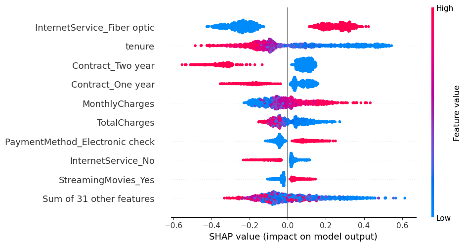

# SHAP Analysis for the XGBoost model

## 📌 Conclusion
Based on the beeswarm chart the ideal customer to target to avoid churn has the following features:
    1. Customers with Fiber Optics  
    2. New customers aka low tenure  
    3. With no contract 1 or 2  
    4. With High monthly charges  
    5. Paying with Electronic check  

